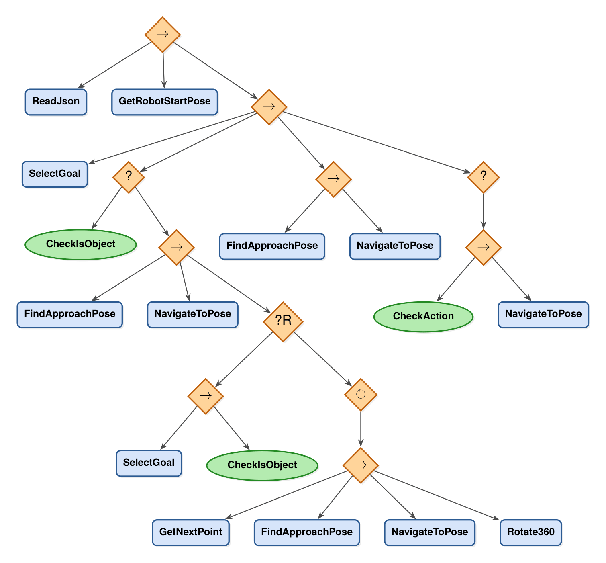

# bt_pkg

Execution layer of the semantic-navigation thesis stack.

A [BehaviorTree.CPP](https://www.behaviortree.dev/) mission manager that turns the LLM's structured
command into robot motion. It reads `robot_command.json`, queries the clustered semantic map published
by `yolo11_seg_bringup`, decides *which* object to go to (or *which room to search* when the object has
not been seen yet), and drives Nav2.

It is the only package in the stack that commands the robot. It runs no models and builds no map — it
consumes both.

```
robot_command.json ──┐
                     ├──▶ bt_manager ──▶ Nav2 (navigate_to_pose)
/vision/clustered_map_v6 ─┘     │
                                └──▶ /vision/get_room_waypoint, /vision/get_approach_pose
```

---

## The tree



*`→` sequence, `?` fallback, `?R` reactive fallback, `↻` repeat, green = condition.*

The mission reads left to right: parse the command, capture the start pose, then a decide-and-navigate
sequence. `SelectGoal` sets `is_object`, and the fallback right after it is the fork that matters:

- **`CheckIsObject` succeeds** — the goal object is already in the map. Skip exploration, go straight to
  the "NavigateToGoal" sequence.
- **`CheckIsObject` fails** — the goal has not been seen. Enter the exploration branch: approach the
  anchor object, then a **reactive fallback** that re-runs `SelectGoal` on every tick while an infinite
  `Repeat` loop patrols the room (`GetNextPoint` → `FindApproachPose` → `NavigateToPose` → `Rotate360`).
  The moment `SelectGoal` finds the object, `CheckIsObject` succeeds, the reactive fallback's first
  branch wins, and the patrol is halted mid-motion.

That reactive fallback is the core of the design: exploration is not a fixed plan, it is a loop that
gets pre-empted as soon as perception catches up. `Rotate360` exists because the object map only grows
where the camera has looked, so a spin at each waypoint is what actually populates the room.

After arrival, `CheckAction` decides whether the mission ends at the goal or the robot returns to
`start_pose` (`bring_back_object`).

---

## How the mission is encoded

`ReadJson` parses `config/robot_command.json` (written by `scripts/reduced_llm_transformers.py` in
`yolo11_seg_bringup`) onto the blackboard:

| JSON field | Blackboard | Use |
|---|---|---|
| `goal` | `goal_class` | filters candidates from the clustered map |
| `cluster_info.cluster_id` | `cluster` | which room to search — **mandatory**, node fails if missing or `< 0` |
| `logic` | `logic` | selects the `SelectGoal` strategy below |
| `action` | `robot_action` | `go_to_object` or `bring_back_object` |
| `anchor_object_class` / `anchor_object_id` | `anchor_class` / `anchor_id` | spatial anchor used as the first exploration target |

`SelectGoal` implements three strategies, chosen by `logic`
([select_goal.cpp:144-218](src/select_goal.cpp#L144-L218)):

| `logic` | Strategy |
|---|---|
| `GENERIC_OBJECT` | nearest instance of `goal_class` to the start pose |
| `GENERIC_OBJECT_SPECIFIC_LOCATION` | nearest instance **inside `cluster`**; explore the room if none there |
| `SPECIFIC_OBJECT_WITH_FEATURES` | highest SigLIP `similarity`; explore the room if the best score is below `similarity_threshold` (8.0) |

Every strategy falls back to `target_pose = cluster_centroid` with `is_object = false` when it cannot
commit — that is what routes the tree into the exploration branch. Unknown `logic` strings default to
`GENERIC_OBJECT` with a warning.

---

## Leaf nodes

| Node | Type | What it does |
|---|---|---|
| `ReadJson` | action | parses `robot_command.json` onto the blackboard |
| `GetRobotStartPose` | action | TF `map → base_link`, stored as the return pose |
| `SelectGoal` | action | subscribes `/vision/clustered_map_v6`, filters by class, applies the logic strategy, outputs `target_pose`, `anchor_pose`, `cluster_centroid`, `is_object` |
| `CheckIsObject` | condition | true when a concrete object was selected |
| `CheckAction` | condition | true only for `bring_back_object` |
| `FindApproachPose` | action | calls `/vision/get_approach_pose` — a reachable, correctly-oriented pose near the target |
| `GetNextPoint` | action | calls `/vision/get_room_waypoint` — next safe exploration point in the room |
| `NavigateToPose` | stateful action | Nav2 `navigate_to_pose` client; cancels the goal on halt |
| `Rotate360` | stateful action | spins in place at 0.5 rad/s on `/jackal/platform/cmd_vel` |
| `CheckGoalSeen` | condition | registered and compiled, **not used** by the current tree |

---

## Interfaces

**Subscribes** `/vision/clustered_map_v6` (`ClusteredMapObjectArray`) · **Publishes**
`/jackal/platform/cmd_vel` (`geometry_msgs/TwistStamped`) · **Actions** `navigate_to_pose`
(`nav2_msgs/NavigateToPose`) · **Services** `/vision/get_room_waypoint` (`GetRoomWaypoint`),
`/vision/get_approach_pose` (`GetApproachPose`) · **TF** `map → base_link`

Both services are served by `cluster_assignment_node` in `yolo11_seg_bringup`.

---

## Build and run

Dependencies: `behaviortree_cpp`, `rclcpp`, `rclcpp_action`, `nav2_msgs`, `nav2_behavior_tree`,
`nav_msgs`, `geometry_msgs`, `tf2_ros`, `tf2_geometry_msgs`, `nlohmann_json`, and the external
`yolo11_seg_interfaces`.

```bash
cd /home/workspace/ros2_ws
colcon build --packages-select yolo11_seg_interfaces bt_pkg
source install/setup.bash
ros2 run bt_pkg bt_manager
```

Before starting it, all of these must be up, or the tree fails at its first tick:

1. Nav2 (`navigate_to_pose` action + global costmap) and TF `map → base_link`
2. `cluster_assignment_node` — publishes the clustered map and serves both services
3. `config/robot_command.json` — written by the LLM script, with a valid `cluster_info.cluster_id`

The tree ticks at 10 Hz. Third-party loggers (`rcl`, `rmw`, `rclcpp`, …) are muted to WARN in
[main.cpp:28-34](src/main.cpp#L28-L34) so the mission narrative — `[COMMAND]`, `[SEARCH]`,
`[DECISION]`, `[GOAL]`, `[EXPLORE]`, `[SCAN]`, `[POSE]`, `[MISSION]` — reads cleanly on screen.

---

## Caveats

- **Hardcoded paths.** The XML path is compiled into
  [main.cpp:56](src/main.cpp#L56) (`/home/workspace/ros2_ws/src/bt_pkg/bt_xml/behavior_tree.xml`), and
  the command file path is hardcoded in the XML. Both must be edited if the workspace moves.

- Platform-specific topic: `cmd_vel` is `/jackal/platform/cmd_vel`.

---

## License

TODO — `package.xml` still declares `TODO: License declaration`.
